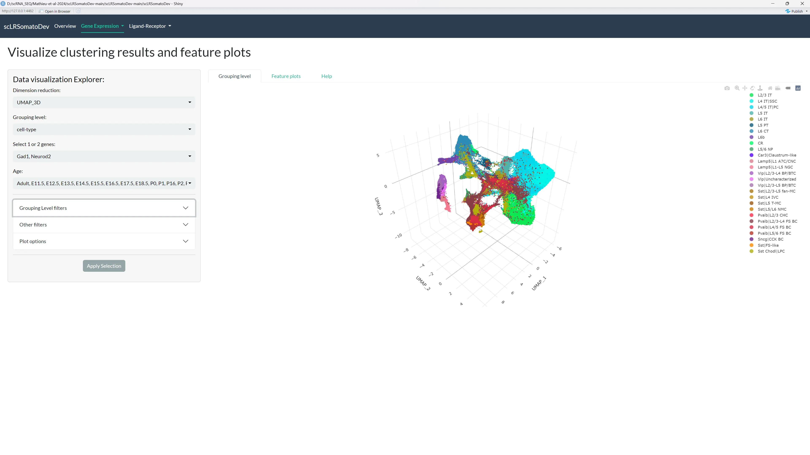
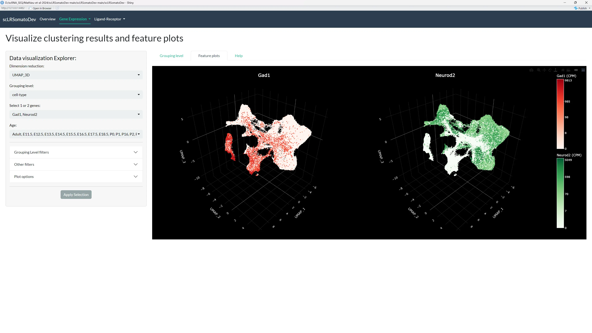
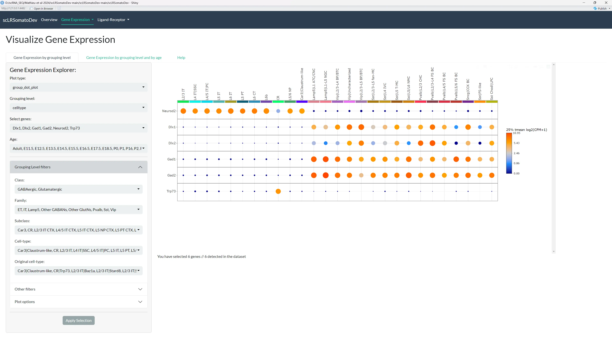
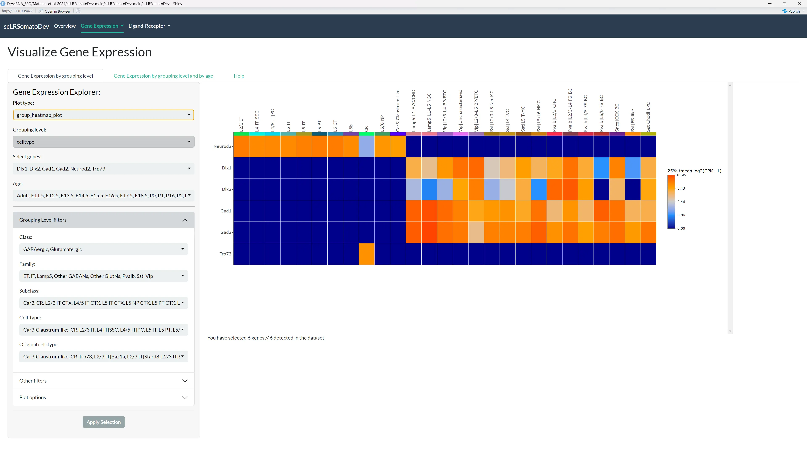
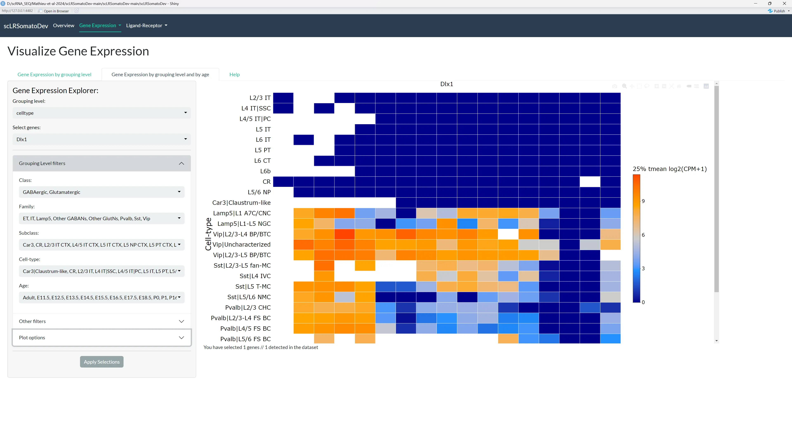
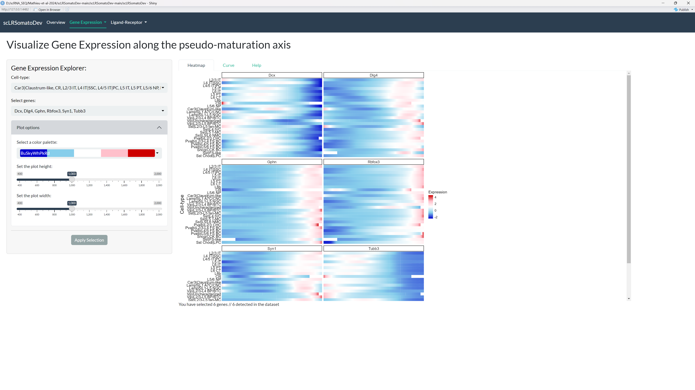
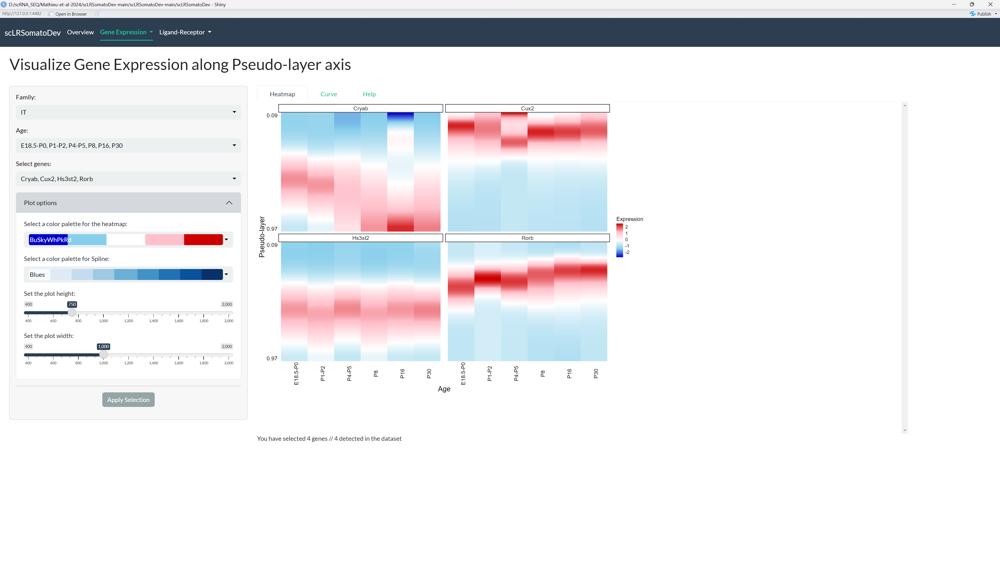
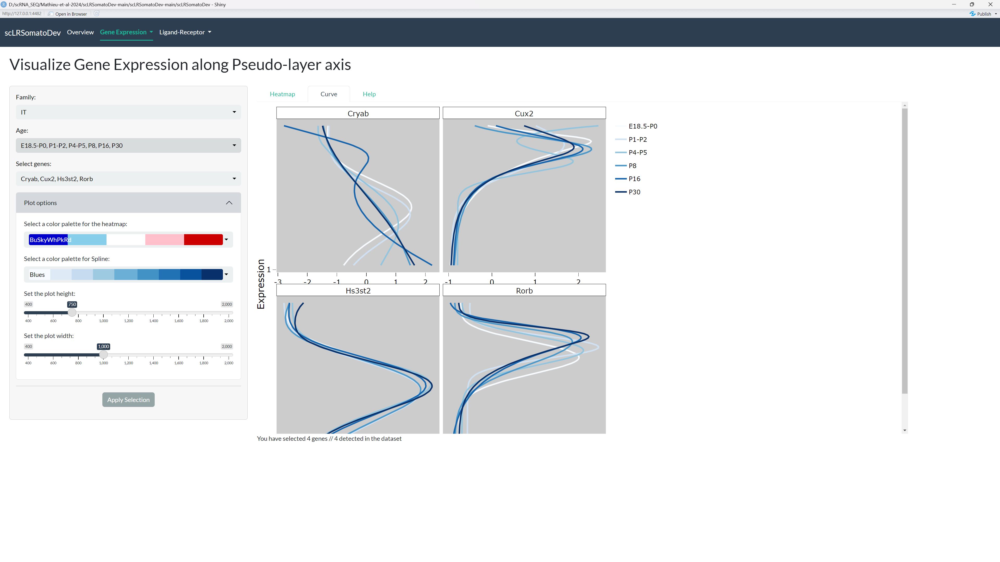
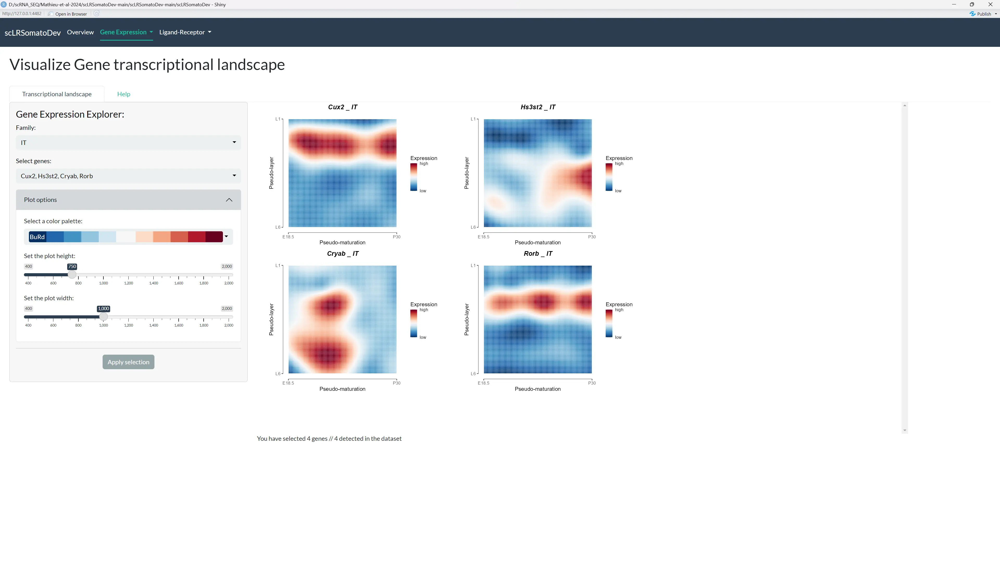

# Gene Expression

This tab allows to visualize the expression of a given genes in the different cell types of the somatosensory cortex.

## Metadata Table

Access and review the metadata associated with the 17 datasets used in this study. 

You can filter the table, change the number of rows displayed, and navigate through pages.

***In case you need more information about the metadata, you can find a detailed description in the Help tab.***

The metadata contains detailed information about:

- **Cell Information**: `orig.ident`, `nCount_RNA`, `nFeature_RNA`, `percent.mito`, `percent.ribo`, `Doublet.score`, etc.
- **Sample Information**: `platform_id/label/color`, `age.at.collection`, `S.Score`, `G2M.Score`, `Phase`, `region_id/label/color`, `study_id/label/color`, etc.
- **Cell Type Information**: `pred.class_PAB21model_id/label/color`, `class_id/label/color`, `pred.class_hicat_id/label/color`, etc.
- **Branch Information**: `all.branch1_score/enrichment`, `pred.branch_MM_id/label/color`, `branch_id/label/color`, etc.
- **Cluster Information**: `cluster_id/label/color`, `supertype_id/label/color`, `subclass_id/label/color`, etc.
- **Dimensionality Reduction**: UMAP, tSNE, PCA, and ICA coordinates.

***The table data can be downloaded as a CSV or XLSX file, but note that only the visible rows will be downloaded.***

## Clustering results and Feature plots

This section is divided into two primary parts:

- **[Clustering results by grouping level](#clustering-results-by-grouping-level)**: Visualize cell identities on a dimensionality reduction plot.
- **[Feature plots](#feature-plots)**: Visualize the expression of one or two genes on on a dimensionality reduction plot.

**All plots are interactive**, allowing you to Zoom in, Zoom out and hover on points to view cells metadata.

    <input type="radio" id="tab-clustering" name="image-tabs-clustering" checked>
    <label for="tab-clustering">Clustering</label>
    <input type="radio" id="tab-features" name="image-tabs-clustering">
    <label for="tab-features">Feature Plot</label>

    

        
    

    

        
    

### Clustering results by grouping level

The plot displays the clustering results of the cells selected by your filters in the UMAP/t-SNE space. 

By default, the app will display the 3D UMAP using the grouping level "cell-type" for all combined time points. We invite you to **customize the plot parameters using the sidebar panel to find the best visualization for your analysis.**

- **Main Filters**: Choose dimension reduction method, grouping level, age, and select up to two genes for the feature plot.
- **Grouping Level Filters**: Filter by class, family, subclass, cell-type, etc.
- **Other Filters**: Filter by region, study, platform, or RNA-seq method.
- **Plot options**: Adjust the plot height.

***Once you obtain the plot you are interested in, you can download the plot as SVG file using the download button in the top right corner of the plot (camera icon).***

### Feature plots

This plot shows the expression of on or two genes on a dimensionality reduction plot using your filters. This kind of representation is useful to visualize the distribution of expression of a gene in a given groups of cells.

The expression of the genes is displayed as CPM (counts per million) values. As the plots are interactive, we invite you to zoom in and out and hover on points to see the a detailed metadata of the cells expressing the gene.

***Once you obtain the plot you are interested in, you can download the plot as SVG file using the download button in the top right corner of the plot (camera icon).***

## Absolute Expression

This section has two subsections to visualize gene expression:

1.  **[Gene expression by grouping level](#gene-expression-by-grouping-level)**: Visualizes the expression of up to 500 selected genes by grouping level, on either a heatmap or a dot plot.
2.  **[Gene expression by grouping level and by age](#gene-expression-by-grouping-level-and-by-age)**: Visualizes the expression of a selected gene categorized by your chosen grouping level at each age, on a heatmap.

**All plots are interactive**, allowing you to Zoom in, Zoom out and hover on points to view metadata.

    <input type="radio" id="tab-dotplot" name="image-tabs-absolute" checked>
    <label for="tab-dotplot">Dot Plot</label>
    <input type="radio" id="tab-heatmap" name="image-tabs-absolute">
    <label for="tab-heatmap">Heatmap</label>
    <input type="radio" id="tab-age" name="image-tabs-absolute">
    <label for="tab-age">By Age</label>

    

        
    

    

        
    

    

        
    

### Gene expression by grouping level

This plot shows the gene expression of the genes selected by your filters on a heatmap or a dot plot. When using the dot plot, the dot size represents the proportion of cells (%) expressing the gene within cells filtered by your parameters.

You can granularly filter the data to be displayed by:

-   **Grouping level**: Select the identity of the cells that you want
    to be displayed. it can be:
    - **Class**: GABAergic or Glutamatergic or both.
    - **Family**: any combination of ET, IT, Lamp5 Pvalb, Sst and others GABANS or GLUTNs.
    - **Subclass**: any combination of Car3, CR, L2/3 IT CTX, L4/5 IT CTX, L5 IT CTX, L5 NP CTX, L5 PT CTX, L6 CT CTX, L6b CTX, Lamp5, Pvalb, Sncg, Sst, Sst Chodl and Vip. 
    - **Cell-type**: any combination of Car3 Claustrum-like, CR, L2/3 IT, L4 IT|ssc, L4/5 IT|PC, L5 IT, L5/6 NP, L6 IT, L6b, Lamp5|L1-L5 NGC, Lamp5|L1 A7C/CNC, Pvalb|L2/3-L4 FS BC, Pvalb|L2/3 CHC, Pvalb|L4/5 FS BC, Pvalb|L5/6 FS BC, Sncg|CCK BC, Sst Chodll|LPC, Sst|FS-like, Sst|L2/3-L5 fan-MC, sst|L4 IVC, sst|L5 T-MC, Sst|L5/L6 NMC, Vip|L2/3-L4 BP/BTC, Vip|L2/3-L5 BP/BTC and Vip|Uncharacterized. 
    - **Original cell-type** is a even more fine-grained grouping level that can be used to filter the data.

-   **Age**: Select the age that you want to be displayed. **Note that if you select multiple ages, the expression of the genes will be averaged across the selected ages.**

-   **Region**: Select the region that you want to be displayed.

-   **Study**: Select the study that you want to be displayed.

-   **Platform**: Select the sequencing platform that you want to be
    displayed.

-   **RNA-seq method**: Select the RNA-seq method that you want to be
    displayed.

***Once you have selected the parameters, select the genes that you want to be displayed (up to 500 genes can be selected at a time).***

***You can download as SVG file using the download button in the top right corner of the plot (camera icon).***

### Gene expression by grouping level and by age

This plot shows the gene expression of the genes selected by your filters on a heatmap, categorized by your chosen grouping level at each age. This kind of representation is useful to visualize the evolution of the expression of a gene in a given groups of cells at different ages.

***Once you have selected the parameters, you can download the plot as SVG file using the download button in the top right corner of the plot (camera icon).***

## Pseudo-maturation

Visualize the dynamics of gene expression along the pseudo-maturation axis, either as a heatmap or as curves. 
You can filter by family (ET, IT, Lamp5 Pvalb, Sst,others GABANS or others GLUTNs) and select up to 50 genes.

    <input type="radio" id="tab-pseudo-heatmap" name="image-tabs-pseudo" checked>
    <label for="tab-pseudo-heatmap">Heatmap</label>
    <input type="radio" id="tab-pseudo-curve" name="image-tabs-pseudo">
    <label for="tab-pseudo-curve">Curve</label>

    

        
    

    

        
    

## Pseudo-layer

Visualize the dynamics of gene expression along the pseudo-layer axis, either as a heatmap or as curves. 
You can filter by family (ET, IT, Lamp5 Pvalb, Sst,others GABANS or others GLUTNs) and age, and select up to 50 genes.

    <input type="radio" id="tab-layer-heatmap" name="image-tabs-layer" checked>
    <label for="tab-layer-heatmap">Heatmap</label>
    <input type="radio" id="tab-layer-curve" name="image-tabs-layer">
    <label for="tab-layer-curve">Curve</label>

    

        
    

    

        
    

## Transcriptional landscape

Visualize the dynamics of gene expression along both the pseudo-maturation and pseudo-layer axes, represented as a 2D map for each family.
You can filter by family (ET, IT, Lamp5 Pvalb, Sst,others GABANS or others GLUTNs) and select up to 50 genes.

