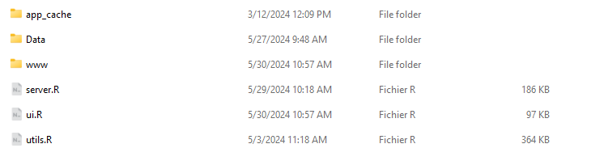

# Installation

There are multiple ways to use scLRSomatoDev, from a simple online version to a local installation for more intensive use.


## Table of Contents

- [Installation](#installation)
  - [Table of Contents](#table-of-contents)
  - [Before starting](#before-starting)
    - [Minimum System Requirements](#minimum-system-requirements)
    - [Installation Tutorial Video](#installation-tutorial-video)
    - [Get the project files](#get-the-project-files)
    - [Download the required data](#download-the-required-data)
  - [Run scLRSomatoDev](#run-sclrsomatodev)
    - [Using Docker (Recommended)](#using-docker-recommended)
      - [Prerequisites](#prerequisites)
      - [1. Build the Docker Image](#1-build-the-docker-image)
      - [2. Run the Docker Container](#2-run-the-docker-container)
      - [3. Launch the App](#3-launch-the-app)
    - [Using RStudio](#using-rstudio)
      - [Prerequisites](#prerequisites-1)
      - [Setup Instructions](#setup-instructions)
      - [Troubleshooting](#troubleshooting)
  - [Next Steps](#next-steps)
    - [Quick Start](#quick-start)
    - [Learn More](#learn-more)

## Before starting

### Minimum System Requirements

* Processor: 8+ cores (Intel/AMD)
* Memory: 32GB RAM (64GB recommended for Docker)
* Storage: 50GB+ free space
* Display: 1920 x 1080 resolution or Higher
* Operating System: Windows 10/11 (64-bit), macOS 10.15+, or Ubuntu 20.04+

### Installation Tutorial Video

**Watch this video tutorial** for a visual guide through the complete installation process before proceeding with the steps below. don't hesitate to watch it multiple times or press pause if you need to.

<iframe width="560" height="315" src="https://www.youtube.com/embed/tkXblcpbLGg" title="YouTube video player" frameborder="0" allow="accelerometer; autoplay; clipboard-write; encrypted-media; gyroscope; picture-in-picture; web-share" allowfullscreen></iframe>

The video above demonstrates the installation process. If you prefer text instructions or encounter issues, continue reading below.

----

### Get the project files

You can get the files using one of the following methods:

*   **Option A: Download ZIP**
    *   Navigate to the "Code" tab on the GitHub repository page.
    *   Select "Download ZIP".
    *   Extract the contents of the ZIP file to your desired location.

*   **Option B: Git Clone**
    *   Open your terminal and run the following command:
        ```bash
        git clone https://github.com/Cortical-interactome/scLRSomatoDev.git
        ```

### Download the required data
* Visit our [Zenodo repository](https://github.com/Cortical-interactome/scLRSomatoDev/) (TODO: Finish Zenodo Repo + add URL).
* Download the `data.zip` file.
* Extract the contents into your scLRSomatoDev folder.
* Verify your folder structure matches the following folder structure :



## Run scLRSomatoDev

> [!NOTE]
> Choose your preferred installation method below. **Docker is recommended** for most users as it provides a consistent, isolated environment.

### Using Docker (Recommended)

> **Why Docker?** Docker ensures all dependencies are properly configured and isolated from your system, making installation more reliable.

#### Prerequisites

*   **Docker**: If you don't have Docker installed, please [download and install it](https://www.docker.com/products/docker-desktop/) before proceeding.

#### 1. Build the Docker Image

Open your terminal, navigate to the project's root directory (the one containing the `Dockerfile`), and run:

**On Linux, Windows and macOS (Intel/AMD):**
```bash
docker build -t sclrshiny .
```

**On macOS (Apple Silicon):**
```bash
docker buildx build --platform linux/amd64 -t sclrshiny .
```

The initial build may take around 20 minutes to download and install the required R packages. Subsequent builds will be much faster.

#### 2. Run the Docker Container

To create a local container from the image you just built, run the appropriate command for your system from the project's root directory:

**On Linux or macOS:**
```bash
docker run --rm -p 3838:3838 -v "$(pwd)/Data:/app/Data" sclrshiny
```

**On Windows (Command Prompt):**
```bash
docker run --rm -p 3838:3838 -v "%cd%\\Data:/app/Data" sclrshiny
```

**On Windows (PowerShell):**
```bash
docker run --rm -p 3838:3838 -v "${PWD}\\Data:/app/Data" sclrshiny
```

This command mounts your local `Data` directory to the `/app/Data` directory inside the container, which is where the app expects to find the data.

#### 3. Launch the App

After running the command, your terminal will display:
```
Listening on http://0.0.0.0:3838
```
The app will be available at http://localhost:3838. It may take a few moments to load.

> You only need to **build the image once**. For future use, you can simply **run the container** and open the link in your web browser.

> **Success with Docker?** Great! [Jump to Next Steps](#next-steps) to start using the app.  
> **Having issues?** Try the [RStudio installation method](#using-rstudio) below or check our [troubleshooting guide](#troubleshooting).

### Using RStudio

> **Alternative Method**: If Docker doesn't work for your system or you prefer direct R development, use this RStudio-based installation. [← Back to Docker instructions](#using-docker-recommended)

#### Prerequisites
* **R**: Tested with R versions 4.3.2 and 4.2. [Download here](https://pbil.univ-lyon1.fr/CRAN/).
* **RStudio**: [Download here](https://posit.co/download/rstudio-desktop/).
* **Conda**: [Download Anaconda or Miniconda](https://www.anaconda.com/download/success).

#### Setup Instructions

* Create a conda environment using the provided environment file:
   
```bash
conda env create -f environment_scLRSomatoDev.yml
```

* Activate the environment:
    
```bash
conda activate r_env
```

* Open RStudio and set the working directory to the scLRSomatoDev folder.

* To run the Shiny app, click the 'Run' or 'Play' button in either the `ui.r` or `server.r` file or run the following command in the console:
   
```r
shiny::runApp("app.R")
```
#### Troubleshooting

> [!CAUTION]
> **Need Help?** This section provides solutions for common installation issues. If you're new to R package management, start with the basics above.  
> [← Back to main installation methods](#run-sclrshiny) | [Report an issue](https://github.com/Cortical-interactome/scLRSomatoDev/issues)

Since R can be tricky when managing dependencies, we have included a list of packages in the `environment_scLRSomatoDev.yml` file.

* If you encounter an error, you may need to install the missing R packages. You can do this by running the following commands in the console:

for a single specific package:   
```r
install.packages("package_name")
```
for multiple packages:
```r
install.packages(c("package_name1", "package_name2", "package_name3"))
```
some packages might not be available on CRAN, you can install them from Bioconductor or github using the following command:

for Bioconductor packages:
```r
BiocManager::install("package_name")
```
for github packages:
```r
remotes::install_github("username/repo")
```

We are aware that R packages management and dependencies can be difficult. If you cannot find the package you need, you can ask for help on the [issues](https://github.com/Cortical-interactome/scLRSomatoDev/issues) page.

> [!WARNING]
> **Need Help?** If you encounter any issues during installation, check our [troubleshooting section](#troubleshooting) above or ask for help on the [issues](https://github.com/Cortical-interactome/scLRSomatoDev/issues) page.

## Next Steps

Once you have successfully installed the app, you can start exploring scLRSomatoDev's features and functionalities. Here are some recommended next steps:

### Quick Start
- **Launch the app** using the instructions in the [Run scLRSomatoDev](#run-sclrshiny) section above
- **Explore the interface** - The app opens with an "Overview" page that introduces the main features

### Learn More
- **[Gene Expression Analysis](Gene%20Expression.md)** - Learn about visualizing gene expression data, clustering results, and developmental trajectories
- **[Ligand-Receptor Interactions](Ligand-Receptor.md)** - Discover cell-cell communication analysis and signaling pathways
- **[About the Project](About.md)** - Read about the scientific background and methodology
