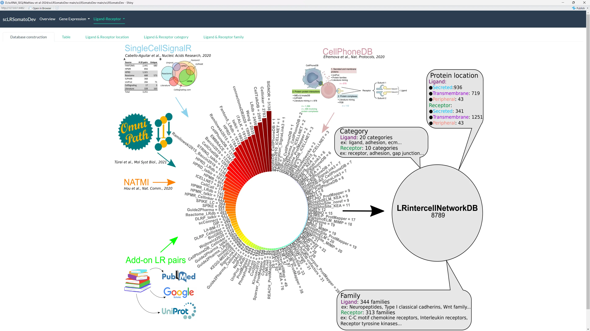
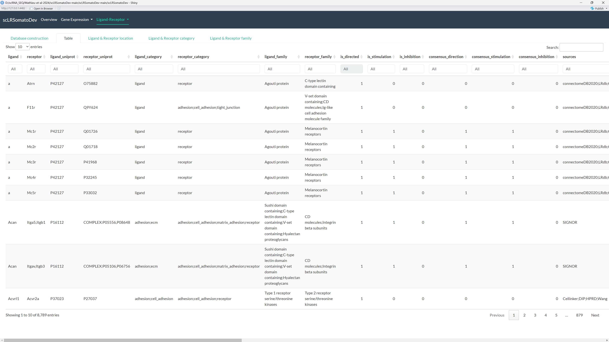
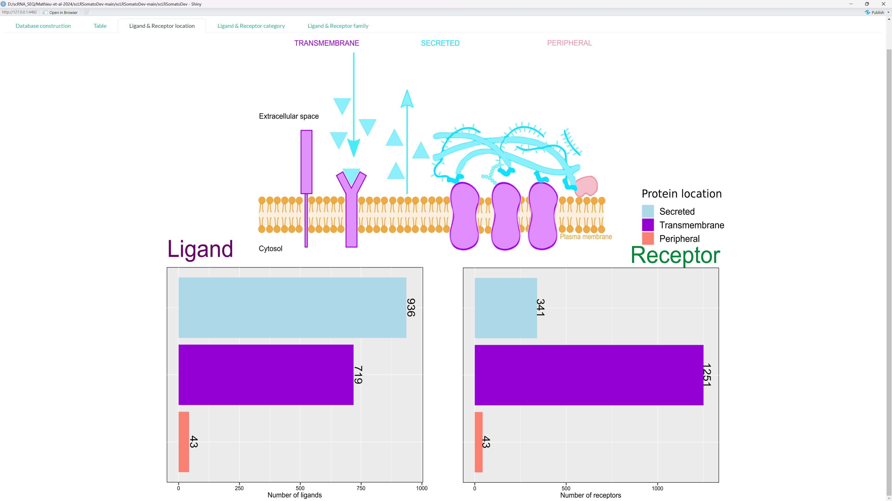
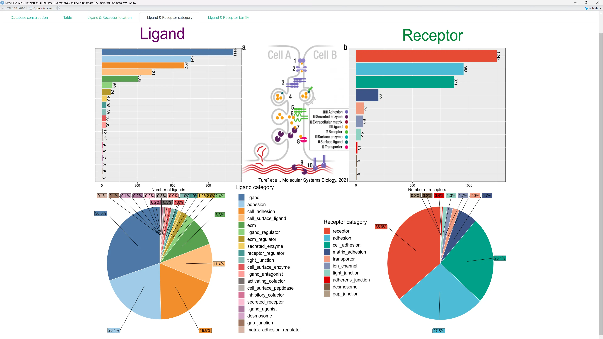
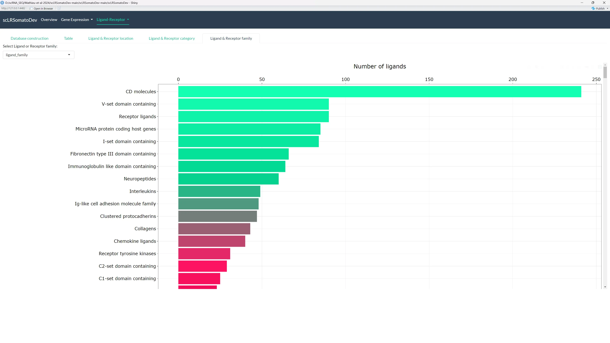
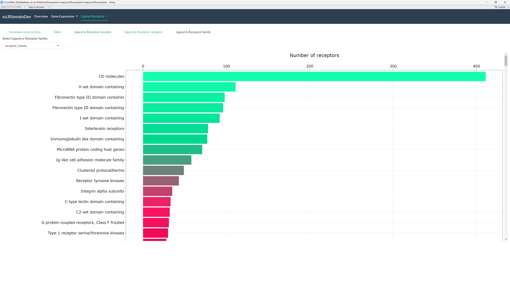
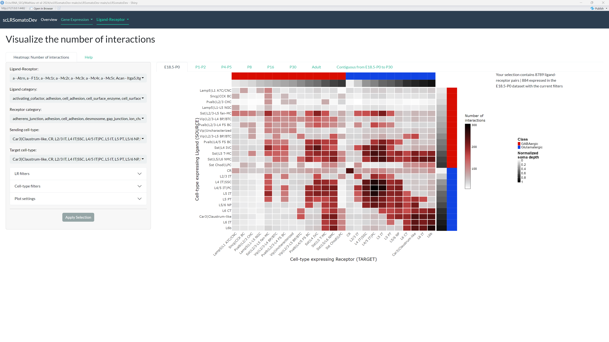
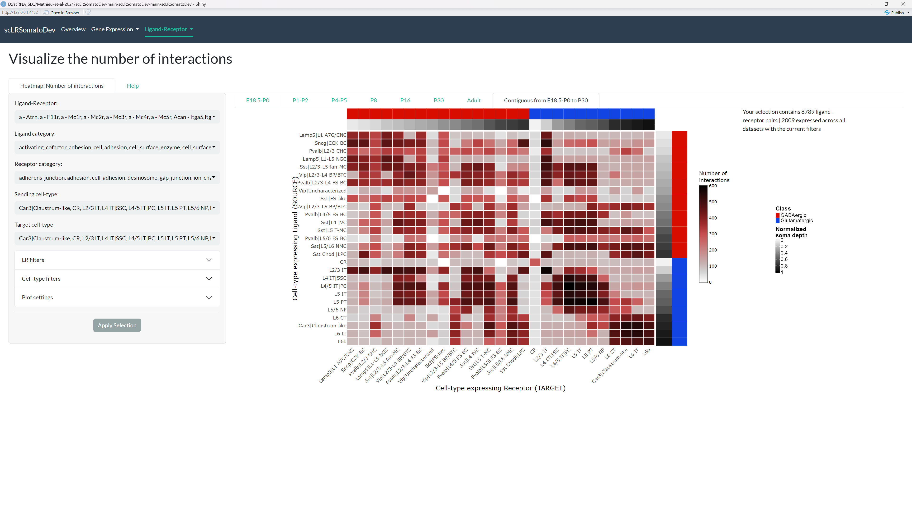
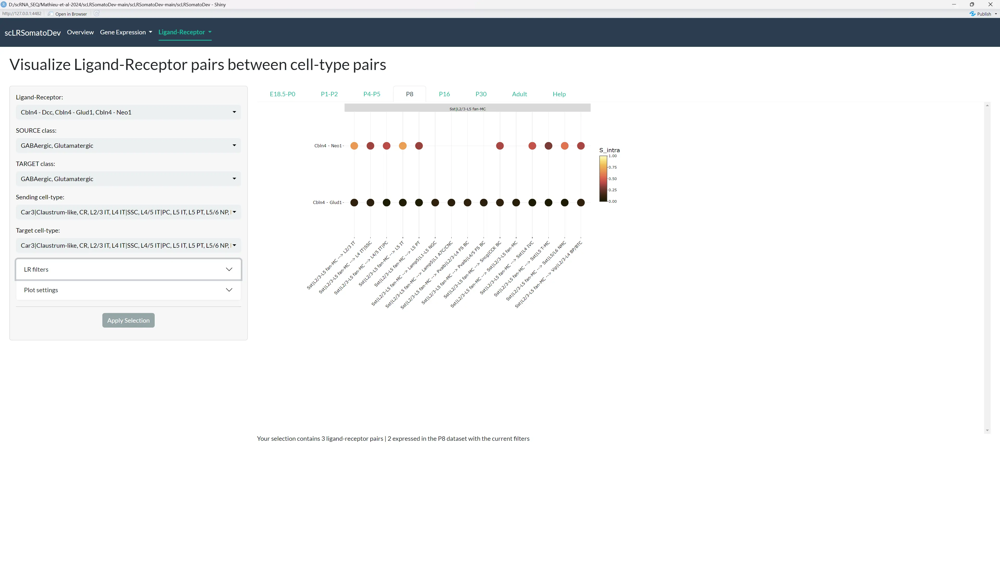
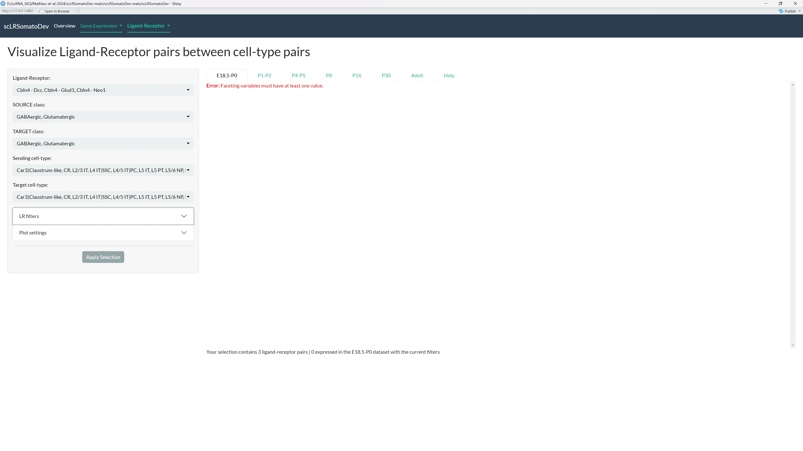

# Ligand-Receptor

## LRintercellNetworkDB

Explore the curated database of ligand-receptor pairs.

    <input type="radio" id="tab-lrdb-main" name="image-tabs-lrdb" checked>
    <label for="tab-lrdb-main">Database</label>
    <input type="radio" id="tab-lrdb-table" name="image-tabs-lrdb">
    <label for="tab-lrdb-table">Table</label>
    <input type="radio" id="tab-lrdb-location" name="image-tabs-lrdb">
    <label for="tab-lrdb-location">Location</label>
    <input type="radio" id="tab-lrdb-category" name="image-tabs-lrdb">
    <label for="tab-lrdb-category">Category</label>
    <input type="radio" id="tab-lrdb-ligand" name="image-tabs-lrdb">
    <label for="tab-lrdb-ligand">Ligand Family</label>
    <input type="radio" id="tab-lrdb-receptor" name="image-tabs-lrdb">
    <label for="tab-lrdb-receptor">Receptor Family</label>

    

        
    

    

        
    

    

        
    

    

        
    

    

        
    

    

        
    

## LR Table

Access the tables resulting from intercellular and intracellular signaling analyses performed with scSeqComm (Baruzzo et al., 2022) for each developmental age, .ie., E18.5-P0, P1-P2, P4-P5, P8, P16, P30, and Adult.

You can filter the table, change the number of rows displayed, and navigate through pages.

The table contains detailed information about:

- **Ligand and Receptor Information**: `ligand`, `receptor`, `LR_pair`, `Ligand.category`, `Receptor.category`, `directed`, `stimulation`, `inhibition`, etc.
- **Cell-Type Interaction Information**: `cluster_L` (source), `cluster_R` (target), `interaction`, `SOURCE.class`, `TARGET.class`, `age.at.collection`.
- **Scores**: `S_inter`, `S_intra`, `conn.score`, `dev.score`, and various other scores for ranking interactions.
- **Pathway Information**: The biological signaling pathway activated in the target cell.

***The table data can be downloaded as a CSV or XLSX file, but note that only the visible rows will be downloaded.***

## Number of interactions

### Tutorial Video

**Watch this video tutorial** to learn how to explore and analyze the number of ligand-receptor interactions between cell types across different developmental stages. Don't hesitate to watch it multiple times or press pause if you need to.

<iframe width="560" height="315" src="https://www.youtube.com/embed/iDKWQTSqXAc" title="YouTube video player" frameborder="0" allow="accelerometer; autoplay; clipboard-write; encrypted-media; gyroscope; picture-in-picture; web-share" allowfullscreen></iframe>

The video above demonstrates how to navigate the interaction number visualizations and customize the heatmaps. If you prefer detailed text instructions, continue reading below.

----

This section is divided in two parts:

- **[Defined time points](#defined-time-points)**: Visualize the number of predicted interactions (ligand-receptor pairs) between each cell-type pair for each developmental age, .i.e. , E18.5-P0, P1-P2, P4-P5, P8, P16, P30, and Adult. 
- **[Contiguous from E18.5 to P30](#contiguous-from-e185-to-p30)**: Visualize the number of predicted interactions (ligand-receptor pairs) between each cell-type pair in contiguous ages, .i.e. , E18.5-P0, P1-P2, P4-P5, P8, P16, P30.

**All plots are interactive**, allowing you to Zoom in, Zoom out and hover over each cell to see the source, target, and number of interactions.

    <input type="radio" id="tab-noi-main" name="image-tabs-noi" checked>
    <label for="tab-noi-main">Defined time points</label>
    <input type="radio" id="tab-noi-contiguous" name="image-tabs-noi">
    <label for="tab-noi-contiguous">Contiguous from E18.5 to P30</label>

    

        
    

    

        
    

### Defined time points

Visualize the number of predicted interactions (ligand-receptor pairs) between each cell-type pair for each developmental age (E18.5-P0, P1-P2, P4-P5, P8, P16, P30, and Adult) represented as an heatmap. 

You can filter the heatmap by:

- **LR filters**: `Ligand-Receptor` pair, `Ligand category`/`family`, `Receptor category`/`family`, and `pathway`.
- **Cell-type filters**: `Sending cell-type`, `target cell-type`, `SOURCE class`, and `TARGET class`.
- **Plot settings**: Adjust color palette and height.

***Once you obtain the plot you are interested in, you can download the plot as SVG file using the download button in the top right corner of the plot (camera icon).***

### Contiguous from E18.5 to P30

Visualize the number of predicted interactions (ligand-receptor pairs) between each cell-type pair in contiguous ages (from E18.5 to P30) represented as an heatmap. 

You can filter the heatmap by:

- **LR filters**: `Ligand-Receptor` pair, `Ligand category`/`family`, `Receptor category`/`family`, and `pathway`.
- **Cell-type filters**: `Sending cell-type`, `target cell-type`, `SOURCE class`, and `TARGET class`.
- **Plot settings**: Adjust color palette and height.

***Once you obtain the plot you are interested in, you can download the plot as SVG file using the download button in the top right corner of the plot (camera icon).***

## Intercellular/Intracellular signaling

### Tutorial Video

**Watch this video tutorial** to learn how to use intercellular and intracellular signaling plots to explore ligand-receptor pairs, and understand the pathways involved in cell-cell communication. Don't hesitate to watch it multiple times or press pause if you need to.

<iframe width="560" height="315" src="https://www.youtube.com/embed/U-HCEW2Swzc" title="YouTube video player" frameborder="0" allow="accelerometer; autoplay; clipboard-write; encrypted-media; gyroscope; picture-in-picture; web-share" allowfullscreen></iframe>

The video above demonstrates how to navigate the signaling analysis visualizations and customize the dot plots. If you prefer detailed text instructions, continue reading below.

----

Visualize which ligand-receptor pairs are likely to be present between cell-type pairs and the pathways in which they are involved. This is shown as a dot plot, available for each developmental age.
By default, LR-pairs are on the y-axis and interactions are on the x-axis. The dot size represents the `S_inter` score and the color represents the `S_intra` score.

**All plots are interactive**, allowing you to Zoom in, Zoom out and hover over each dot to see the source, target, and detailed information about the interaction.

If there is no data available for a given cell-type pair, the plot will display an error message: ***Faceting variables must have at least one value.(see second image)***

    <input type="radio" id="tab-inter-main" name="image-tabs-inter" checked>
    <label for="tab-inter-main">LR-pairs Plot</label>
    <input type="radio" id="tab-inter-error" name="image-tabs-inter">
    <label for="tab-inter-error">Error / No Data</label>

    

        
    

    

        
    

You can customize the plot:

- **Cell-type and LR filters**: Filter by `ligand-receptor`, `SOURCE class`, `TARGET class`, `pathway`, `Sending cell-type`, `Target cell-type`, `Ligand category`/`family`, and `Receptor category`/`family`.
- **Plot settings**: You can customize the x-axis, y-axis, faceting, dot size, and dot color based on different variables.

***Once you obtain the plot you are interested in, you can download the plot as SVG file using the download button in the top right corner of the plot (camera icon).***
