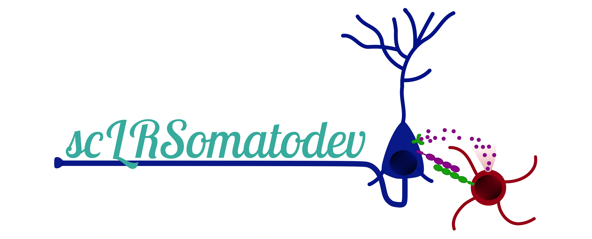

## Welcome to scLRSomatoDev documentation

This Shiny App has been made to visualize the ligand-receptor interactions between GABAergic and Glutamatergic cells during Somatosensory Cortex development.

Created and maintained by Rémi MATHIEU (INMED, INSERM, Aix Marseille Univ, France).

This documentation provides a guide to the features available in the app.

## Getting Started

To begin using scLRSomatoDev, please visit the [Installation](Installation.md) page for setup instructions. You can choose from multiple installation options including an online version, local R setup, or Docker deployment.

## Gene Expression

The "Gene Expression" tab allows you to visualize gene expression data in various ways:

- **[Metadata Table](Gene%20Expression.md#metadata-table)**: Browse and download metadata for the 17 datasets.
- **[Clustering results and Feature plots](Gene%20Expression.md#clustering-results-and-feature-plots)**: Visualize cell populations and gene expression on UMAP plots.
- **[Absolute Expression](Gene%20Expression.md#absolute-expression)**: View heatmaps or dot plots of gene expression per cell-type across development.
- **[Pseudo-maturation](Gene%20Expression.md#pseudo-maturation)**: Analyze gene expression dynamics along the pseudo-maturation axis.
- **[Pseudo-layer](Gene%20Expression.md#pseudo-layer)**: Analyze gene expression dynamics along the pseudo-layer axis.
- **[Transcriptional landscape](Gene%20Expression.md#transcriptional-landscape)**: Explore a 2D map of gene expression along both pseudo-maturation and pseudo-layer axes.

## Ligand-Receptor Interactions

The "Ligand-Receptor" tab focuses on cell-cell communication:

- **[LRintercellNetworkDB](Ligand-Receptor.md#lrintercellnetworkdb)**: Explore the curated database of ligand-receptor pairs.
- **[LR Table](Ligand-Receptor.md#lr-table)**: Access detailed tables of signaling analysis results.
- **[Number of interactions](Ligand-Receptor.md#number-of-interactions)**: Visualize the number of predicted interactions between cell types with a heatmap.
- **[Intercellular/Intracellular signaling](Ligand-Receptor.md#intercellularintracellular-signaling)**: Investigate specific ligand-receptor pairs and their associated pathways with dot plots.

